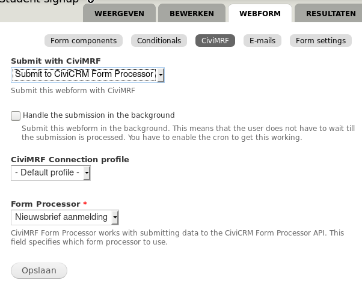
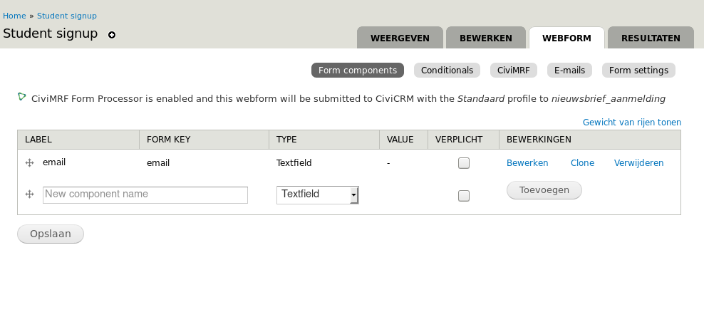

# CiviMRF Form Processor

Submit webforms with CiviMRF to [https://lab.civicrm.org/extensions/form-procesor](**CiviCRM Form Processor**) 

The **CiviCRM Form Processor** extension allows a CiviCRM site administrator to define end points for forms and do the processing in CiviCRM.

For example you could defie a form processor to create or find a contact based on the given email address and then subscribe this contact to the *newsletter* group.
You could then use this module in your external drupal website to process a webform by the form processor in CiviCRM.

Below the screenshot of the form processor in CiviCRM:

 And a screenshot of setup of the drupal webform:

